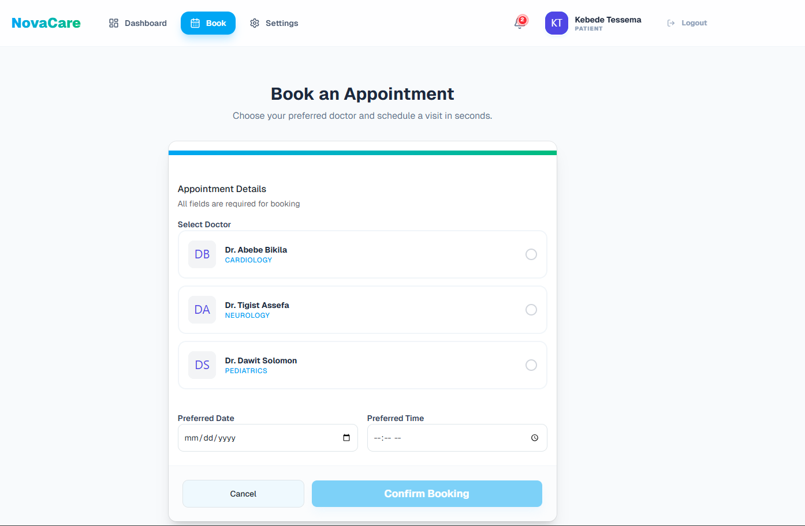
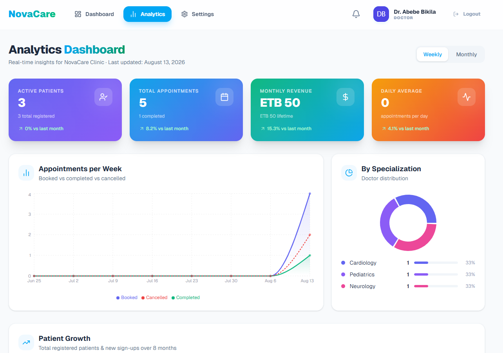
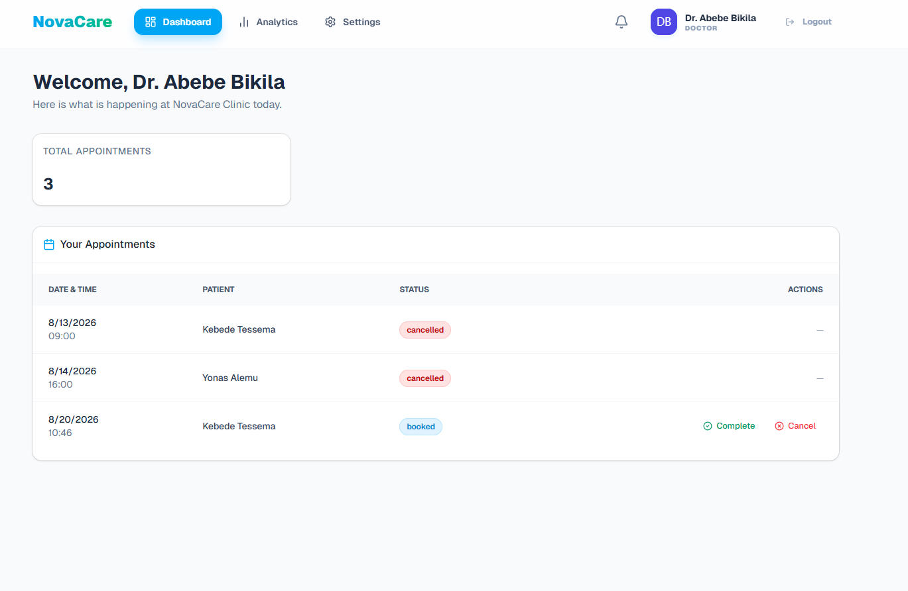

# NovaCare 🏥

A modern, full-stack clinic management system designed to streamline appointment scheduling, doctor management, and real-time notification delivery across three user roles — **Admin**, **Doctor**, and **Patient**.

> Built as a portfolio project to demonstrate production-grade backend architecture, real-time WebSocket integration, and role-based access control.

---

## 🌟 Key Features

### 🔐 Multi-Role Authentication & RBAC
- Dedicated dashboards for **Admin**, **Doctor**, and **Patient** roles
- JWT-based authentication with `bcrypt` password hashing
- Server-side route guards enforcing role permissions on every protected endpoint

### 📅 Appointment Scheduling Engine
- **Double-booking prevention** — time-slot conflict validation at the service layer
- **State machine** — enforces valid status transitions (`booked` → `completed` / `cancelled`)
- **Role-aware authorization** — patients can only cancel, doctors can complete or cancel, admins have full control — enforced in a single unified service function

### 🔔 Real-Time Notification Engine
- **Dual delivery model** — notifications persisted to MongoDB AND emitted live via Socket.IO
- **Targeted routing** — notifications dispatched to the correct recipient (e.g. patient books → doctor is alerted, doctor updates status → patient is alerted)
- **Interactive UI** — unread badge counter, toast popups, and single/bulk mark-as-read controls

### 📊 Analytics & Reporting
- Revenue summaries (lifetime and monthly) formatted in ETB
- Clinic metrics — active doctors, appointment breakdown, patient counts

---

## 🏗️ Architecture Highlights

- **State machine pattern** — `VALID_STATUS_TRANSITIONS` map enforces legal appointment status changes server-side. Invalid transitions are rejected with a `400` regardless of the client request.
- **Unified authorization function** — a single `updateAppointmentStatus` service function handles all three roles with role-aware rules, replacing three separate endpoints.
- **Centralized error handling** — a shared `AppError` class carries HTTP status codes across all modules. Controllers distinguish `404`, `403`, `400`, and `500` errors without duplicating logic.
- **Lazy DB queries** — the doctor lookup in authorization only runs when the requesting user is a doctor, avoiding unnecessary database calls for admin and patient requests.
- **Socket.IO identity mapping** — connected users are stored in a `Map<userId, socketId>` on the server. Notifications are routed to the correct socket without broadcasting to all clients.

---

## 🛠️ Tech Stack

### Frontend
| Layer | Technology |
|---|---|
| Framework | React 18 + TypeScript + Vite |
| UI Components | shadcn/ui + Tailwind CSS |
| State Management | React Context API + Custom Hooks |
| Forms & Validation | React Hook Form + Zod |
| HTTP Client | Axios |
| Real-Time | Socket.io-client |
| Icons | Lucide React |

### Backend
| Layer | Technology |
|---|---|
| Runtime | Node.js + Express + TypeScript |
| Database | MongoDB + Mongoose ODM |
| Authentication | JWT + bcrypt |
| Real-Time | Socket.IO |
| Architecture | Modular MVC (Controllers, Services, Models) |

---

## 🚀 Getting Started

### Prerequisites
- Node.js v18+
- MongoDB instance (local or MongoDB Atlas)

### 1. Clone the repository
```bash
git clone https://github.com/elbetel12/Clinic_Management_System.git
cd Clinic_Management_System
```

### 2. Backend Setup
```bash
cd backend
npm install
```

Create a `.env` file in the `backend` directory:
```env
PORT=5000
MONGO_URI=mongodb://localhost:27017/clinic_management
JWT_SECRET=your_jwt_secret_key_here
JWT_EXPIRES_IN=7d
FRONTEND_URL=http://localhost:5173
```

Seed the database with demo accounts:
```bash
npm run seed
```

Start the backend:
```bash
npm run dev
```

### 3. Frontend Setup
```bash
cd frontend
npm install
```

Create a `.env` file in the `frontend` directory:
```env
VITE_API_URL=http://localhost:5000/api
```

Start the frontend:
```bash
npm run dev
```

---

## 🔑 Demo Accounts

> Password for all accounts: `Password123!`

| Role | Name | Email |
|---|---|---|
| 🛡️ Admin | Amanuel Worku | `admin@novacare.com` |
| 🩺 Doctor | Dr. Abebe Bikila | `dr.abebe@novacare.com` |
| 🩺 Doctor | Dr. Tigist Assefa | `dr.tigist@novacare.com` |
| 🩺 Doctor | Dr. Dawit Solomon | `dr.dawit@novacare.com` |
| 👤 Patient | Kebede Tessema | `kebede.t@gmail.com` |
| 👤 Patient | Muluwork Gebre | `muluwork.g@gmail.com` |

*The login page includes **⚡ Quick Demo** buttons for one-click sign-in.*

---

## 📡 API Reference

### Auth
| Method | Endpoint | Description | Access |
|---|---|---|---|
| POST | `/api/auth/register` | Patient registration | Public |
| POST | `/api/auth/login` | Authenticate + issue JWT | Public |

### Doctors
| Method | Endpoint | Description | Access |
|---|---|---|---|
| GET | `/api/doctors` | List all doctors | Public |
| POST | `/api/doctors` | Add a doctor | Admin |

### Appointments
| Method | Endpoint | Description | Access |
|---|---|---|---|
| GET | `/api/appointments` | Role-filtered appointments | Auth |
| POST | `/api/appointments` | Book an appointment | Patient |
| PATCH | `/api/appointments/:id/status` | Update appointment status | Auth |

### Notifications
| Method | Endpoint | Description | Access |
|---|---|---|---|
| GET | `/api/notifications` | Fetch user notifications | Auth |
| PATCH | `/api/notifications/:id/read` | Mark single as read | Auth |
| PATCH | `/api/notifications/read-all` | Mark all as read | Auth |

### Analytics
| Method | Endpoint | Description | Access |
|---|---|---|---|
| GET | `/api/analytics` | Clinic metrics + revenue | Admin |

---

## 📸 Screenshots

### Booking Page


### Analytics Dashboard


### Appointments Page


---

## 📜 License
This project is open-source under the [ISC License](LICENSE).